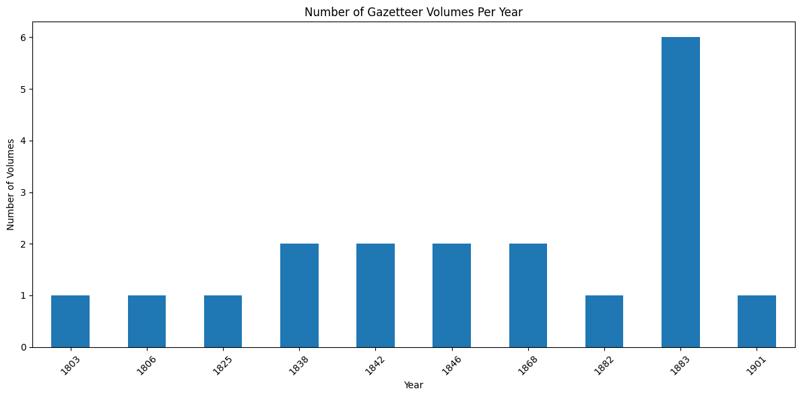

## Construction and Content
{:#resourceconstruction}

The MappingChange knowledge base is built through a multi-stage pipeline that transforms unstructured OCR-aligned ALTO XML files into structured DataFrames and RDF graphs. Each stage of the pipeline is modular and reproducible, with edition-specific scripts documented and openly available in the [MappingChange GitHub repository](https://github.com/francesNLP/MappingChange).

Of the twelve editions in the [NLS collection](https://data.nls.uk/data/digitised-collections/gazetteers-of-scotland/), we process ten  (See Figure 6) as fully descriptive gazetteers with complete metadata and volume structure. We exclude the 1828 edition, which is a town-focused summary rather than a gazetteer, and the 1848 edition, for which only Volume II is available. These ten editions form the basis of the MappingChange resource, with each transformed into a structured DataFrame containing one row per article-level entry.

  

<strong>Figure 6:</strong> Number of volumes per gazetteer edition (1803–1901). The 1883 edition spans six volumes, while most others are single- or double-volume works.

### Article Extraction and Prompt Engineering

As input to our pipeline, we use the [gazetteers_dataframe](https://drive.google.com/file/d/1J6TxdKImw2rNgmdUBN19h202gl-iYupn/view?usp=share_link), a cleaned and consolidated DataFrame derived from our earlier [Gazetteer_HTO knowledge graph](cite:cites yu_2024_14051678). This resource contains entries from the gazetteers editions, each representing the full OCR text of a single page, along with metadata such as edition identifier, volume, page number, and candidate place names.

The goal of this stage is to segment each page into distinct articles and extract structured place descriptions. This task presents several challenges: (a) place names can be ambiguous and refer to multiple locations across different editions; (b) many descriptions span multiple pages; (c) new places are introduced in later editions; (d) descriptions frequently reference other places (e.g *ABBEY PARISH. See Paisley.*), which must also be identified; and (e) places may be listed under multiple or alternative names. Our extraction scripts and prompting strategies are designed to address these complexities by isolating each named place and its corresponding description, including cross-references and aliases.

At the core of the article segmentation process is a set of Python scripts (`extract_gaz_*.py`) that apply GPT-4 to extract article-level place descriptions from OCR text. Each edition has its own script to accommodate layout, editorial, and typographic idiosyncrasies—including abbreviation handling, redirects, and multi-page articles.

A key part of this process is the design of GPT-4 prompts tailored to each gazetteer’s editorial conventions. The base prompt follows an instruction format asking the model to identify and extract gazetteer articles from a page of OCR text. Variants were introduced to handle structural nuances—such as distinguishing index lines from articles in early editions or handling mid-page redirects in later ones.

The table below summarizes the edition-specific characteristics and adaptations in the prompting strategy:

| **Edition** | **Layout/Format Features**                                | **Prompt Adjustments**                                  |
|-------------|------------------------------------------------------------|----------------------------------------------------------|
| 1803        | All caps titles, minimal punctuation, mid-column entries   | Prompt includes rules for semicolon-delimited entries    |
| 1806        | Similar to 1803 with improved spacing                      | Added regex pre-filters to exclude 3-letter headers      |
| 1825        | Shorter entries, denser formatting                         | Emphasis on short entries and abbreviation disambiguation |
| 1838        | Two-column format, clearer title separation                | Prompt refined to distinguish article breaks explicitly  |
| 1842        | Redirects common, layout noisy                             | Includes logic for disambiguating abbreviated redirects  |
| 1846        | Continued abbreviation patterns, multi-page entries        | Includes continuity checks and redirect expansion        |
| 1868        | Longer, structured entries with location hierarchies       | Added cues for nested article types and locations        |
| 1884–1901   | Title-cased entries, structured and clean layout           | Simplified prompts; uses typographic features directly   |

All scripts tokenize OCR text by page and apply the prompt in a batch-efficient manner. Outputs are parsed into structured JSON records that include article text, place name, page number, and other metadata. These are aggregated into edition-specific DataFrames.

### DataFrames to RDF

Each JSON DataFrame is cleaned and mapped to RDF using the Heritage Textual Ontology (HTO). For each article, we instantiate one or more `hto:Description` entities, annotated with quality metrics, extraction method (GPT-4), and source metadata (edition, volume, page). This conversion step is implemented using reusable mapping scripts in Python and SPARQL.

### Semantic Enrichment and Linking

Following RDF generation, the dataset undergoes semantic enrichment through three main procedures:

- **Concept Clustering**: Sentence embeddings and clustering algorithms group semantically similar articles across editions. Resulting `hto:Concept` instances link equivalent or evolving descriptions of the same place.
- **Entity Linking**: `hto:PlaceRecord` and `hto:Concept` instances are matched to external resources via Wikidata and DBpedia using a hybrid of embedding-based and string-matching techniques.
- **Geospatial Annotation**: Named Entity Recognition (NER) and georesolution tools (e.g., Edinburgh Geoparser) are used to annotate and disambiguate place mentions. Each resolved location is stored as a `hto:GeographicAnnotation` with coordinates, spatial type, and provenance.

### Knowledge Graph Serialization and Deployment

The final RDF outputs are serialized in Turtle and hosted in a public Fuseki SPARQL endpoint. In parallel, Elasticsearch indices are built from the JSON and RDF data to support keyword search and semantic similarity queries using embeddings.

All steps—from GPT-4 prompting to RDF generation—are documented in executable scripts and notebooks in the GitHub repository, ensuring full reproducibility. Each transformation stage is also recorded in HTO using provenance properties (`prov:wasGeneratedBy`, `hto:hasTextQuality`, etc.), enabling end-to-end traceability of every knowledge graph triple.

