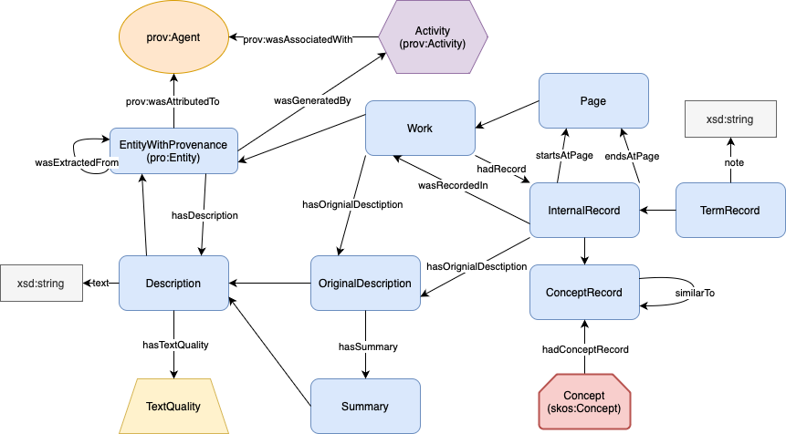
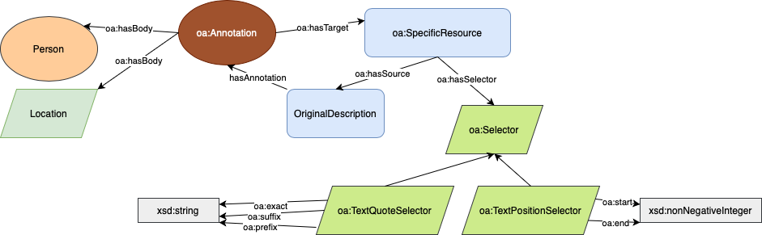
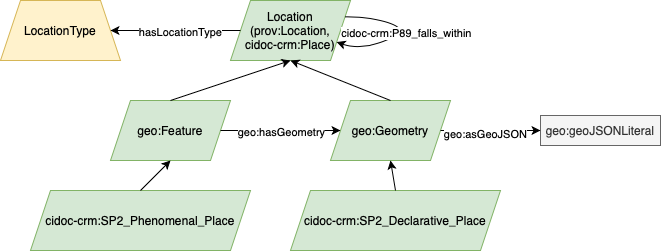
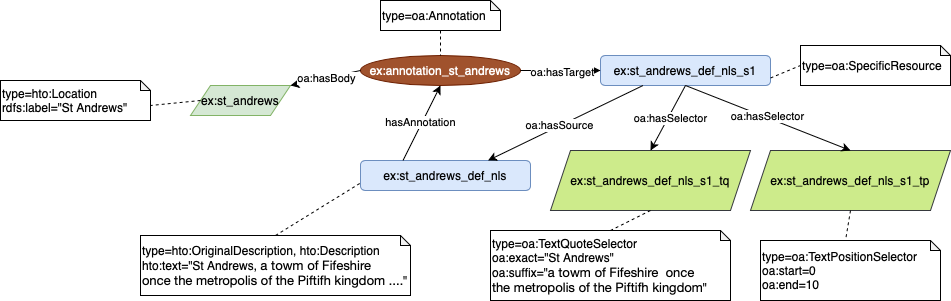

## Heritage Textual Ontology (HTO)
{:#hto}

The [HTO](https://w3id.org/hto) provides the semantic backbone for *MappingChange*, enabling the structured representation of historical textual records, their provenance, and the evolving concepts they describe. Developed to support real-world use cases in digital heritage, HTO models not only entities and attributes, but also the editorial and computational processes by which historical texts are extracted, digitized, interpreted, and semantically enriched. Unlike more generic vocabularies, HTO is tailored to the challenges of heritage corpora—such as OCR noise, editorial variation, and evolving terminology—offering fine-grained support for provenance, textual quality, named entity recognition, and diachronic conceptual alignment.

HTO is [openly developed](https://github.com/frances-ai/HeritageTextOntology), and it builds on established ontologies such as [PROV-O](https://www.w3.org/TR/prov-o/), [SKOS](https://www.w3.org/TR/skos-reference/), [Schema.org](https://schema.org), and [CIDOC CRM](https://www.cidoc-crm.org), while introducing domain-specific classes and properties designed for flexible reuse and extension. Since its initial release, HTO has been extended to support geospatial annotation, richer NER-based enrichment, and explicit modeling of language-model-based transformations, making it suitable for a wider range of digitized corpora.

HTO is modular and extensible, and can be adopted in other projects that require modeling of OCR-derived documents, provenance-aware digitization pipelines, or diachronic semantic alignment. It also plays a central role in enabling FAIR knowledge graph construction with transparent lineage tracking.

### Modeling Bibliographic Structure and Provenance

HTO provides a structured vocabulary for modeling the archival hierarchy of heritage texts (including works, editions, series, and pages) through the class `hto:Work` and its subclasses. Each textual entity is also a `prov:Entity` (`hto:EntityWithProvenance`), enabling provenance tracking for digitization methods (e.g., OCR or manual transcription), quality levels (`hto:TextQuality`), and attribution to specific software or human agents (`prov:Agent`). Works can be grouped into collections using `hto:Collection` and linked to their physical or digital source editions. Figure [2](#fig-hto-bib) illustrates this bibliographic modeling layer.

  

<strong>Figure 2:</strong> Bibliographic and provenance modeling in HTO, including core classes (blue), agents (orange), locations (green), and datatype properties (grey).

### Capturing Textual Records and Interpretations

HTO distinguishes between original descriptions (`hto:OriginalDescription`) and derived or enriched interpretations (`hto:Description`). These are associated with their source pages via `hto:Page` and `hto:hasOriginalDescription`, and annotated with quality levels (e.g., "Low", "Moderate", or "High") based on their provenance. This allows the knowledge base to retain multiple text variants and trace how they were extracted and transformed.

Records within the text are modeled using `hto:InternalRecord` (for local entities) and `hto:ExternalRecord` (for linked data resources such as Wikidata or DBpedia). Repeated terms (like "St Andrews") are tracked across editions via `hto:TermRecord`, while `hto:ConceptRecord` groups semantically similar entries into shared `hto:Concept`s, enabling diachronic alignment. Figure [3](#fig-hto-terms) shows how textual terms and their semantic clusters are represented.

  

<strong>Figure 3:</strong> Modeling of term records and concept clusters using HTO classes for internal and external alignment.

### Geospatial Annotations and Place Modeling

In *MappingChange*, HTO has been extended to support spatial annotation and georesolution. Locations are represented as `hto:Location` and typed using subclasses such as `hto:Town`, `hto:Region`, or `hto:River`. Each place may include spatial geometries using `geo:hasGeometry` or `geo:asGeoJSON`, with optional declarations using `cidoc-crm:SP2_Declarative_Place`. This enables spatial reasoning, integration with GeoSPARQL, and alignment with modern gazetteers and linked data services. See Figure [4](#fig-hto-geo) for an overview of spatial modeling in HTO.

  

<strong>Figure 4:</strong> Representation of locations and spatial types in HTO, including georesolved coordinates and place categorization.

### Annotation and Segment Selection

To link extracted place names or descriptions to their textual anchors, HTO adopts [Web Annotation (OA)](https://www.w3.org/TR/annotation-model/) standards. Each annotation (`oa:Annotation`) includes a source document, a target entity, and selectors (e.g., `oa:TextQuoteSelector`, `oa:TextPositionSelector`) that specify the exact span of text involved. This ensures fine-grained traceability back to OCR-aligned sources and supports downstream validation and curation. An example is shown in Figure [5](#fig-hto-annotation).

  

<strong>Figure 5:</strong> Example of how text segments are annotated and anchored using OA selectors in HTO.

