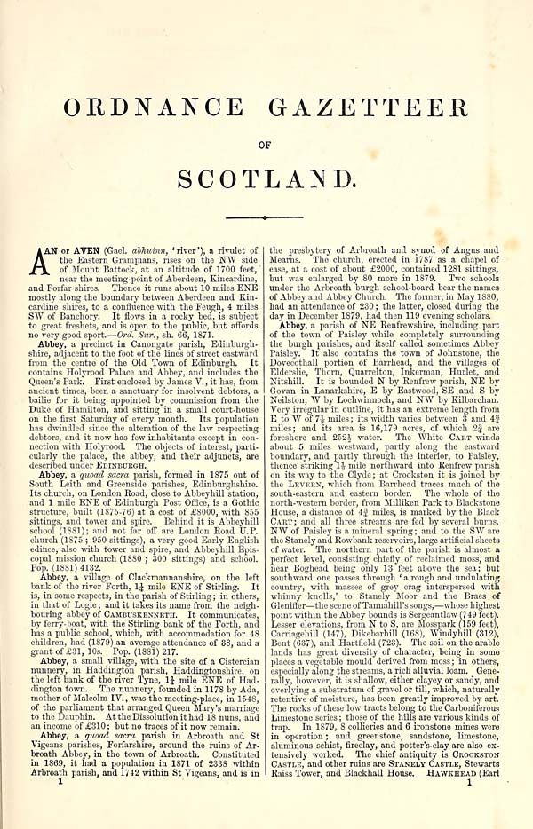

## Introduction
{:#introduction}

Descriptive gazetteers were a cornerstone of how 19th-century Scotland recorded and transmitted its geographical knowledge—capturing towns, parishes, rivers, castles, and natural features within evolving historical, social, and economic narratives. As industrialization, migration, land reform, and empire reshaped the country, these texts became critical instruments for documenting change. The *Gazetteers of Scotland, 1803–1901*, digitized by the [National Library of Scotland (NLS)](https://data.nls.uk/data/digitised-collections), form one of the most extensive corpora for studying this spatial transformation. Yet despite being released as more than 13,000 OCR-aligned ALTO XML files, the collection remains largely unsuitable for structured analysis. The lack of article-level markup, noisy layouts, and inconsistent editorial conventions limit its accessibility for digital scholarship.

Each edition introduces distinct typographic conventions for article headers, redirects, abbreviations, and multi-page entries. In early volumes, place names appear in uppercase with minimal punctuation to separate entries (Figure 1, left), whereas later editions use clearer formatting, including title casing and consistent delimiters (Figure 1, right). These variations complicate traditional rule-based approaches to text segmentation and alignment, making it difficult to trace how a place is described across time or to resolve recurring names that refer to different locations.

Compounding these challenges is the fact that many place names (e.g. “ABBEY”) recur across the gazetteers, often referring to different locations. Moreover, later editions tend to include a broader set of places, meaning some names appear for the first time in later volumes or gain more detailed descriptions over time. Disambiguating such entries is non-trivial, as it depends on contextual clues within each article rather than surface-level patterns. Our approach relies on LLM-based article segmentation and interpretation—capturing subtle editorial cues and semantic context to associate each name with the appropriate description.

To overcome these limitations, we present **MappingChange**, a reusable and openly licensed resource that transforms this historically rich but structurally fragmented corpus into a structured and semantically enriched knowledge base. Our pipeline uses large language models (LLMs) with edition-specific prompt strategies to extract over 50,000 article-level entries and express them in RDF as three interlinked knowledge graphs, modeled using the [Heritage Textual Ontology (HTO)](https://w3id.org/hto). The resulting knowledge base supports both **temporal analysis**, enabling comparison of how place descriptions change across editions, and **semantic exploration**, through the linking of conceptually related entries and connections to [Wikidata](https://www.wikidata.org) and [DBpedia](https://www.dbpedia.org).

A full account of the dataset structure, file formats, and access methods is provided in [Section 3](#resourcedescription). All resources (DataFrames, knowledge graphs, and Elasticsearch indices) are publicly archived and distributed via our [repository](github.com/francesNLP/MappingChange), with persistent identifiers issued via Zenodo and integrated into the [Frances](http://www.frances-ai.com) semantic web platform for visual exploration.

  

    
    

      <strong>Figure 1 (left):</strong> Opening entries of the 1803 <em>Gazetteer of Scotland</em>. Page headers consist of two three-letter uppercase segments (e.g., “ABB ABE”). Place names appear in all caps, typically followed by a period or semicolon—offering minimal typographic separation between entries.
    

  

  

    
    

        <strong>Figure 1 (right):</strong> Opening entries of the 1884 <em>Ordnance Gazetteer of Scotland</em>. This edition features a clearer visual structure, with entries formatted in title case and followed by commas. Page headers display the first and last place names on the page, both rendered in uppercase.
    

  

A
All resources presented in tis work are reproducible from source using openly available scripts, which are detailed in [Section 5](#resourceconstruction). This enables other researchers to reuse, adapt, or extend the MappingChange infrastructure for new corpora, ensuring FAIR data practices and long-term sustainability. In doing so, the project facilitates new forms of historical geography and cultural analytics by making a corpus computationally interoperable, queryable, and reusable across domains.

The remainder of this paper is structured as follows. [Section 2](#relatedwork) reviews related work on Semantic Web methods for cultural heritage, including digitization, ontology design, and the use of large language model. [Section 3](#resourcedescription) provides a detailed description of the MappingChange resource. [Section 4](#hto) details the Heritage Textual Ontology. [Section 5](#resourceconstruction) outlines the end-to-end pipeline for extraction, cleaning, and semantic enrichment. [Section 6](#usage) presents usage scenarios and queries that demonstrate how the resource supports historical research. Finally, [Section 7](#conclusion) concludes with a summary of contributions and future directions.

